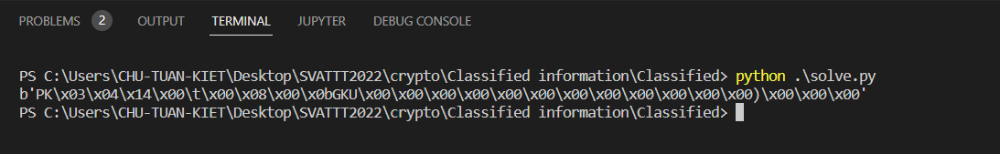

# WRITEUP SVATTT - ASCIS 2022

Sau gần tuần kết thúc kì thi SVATTT hôm nay mình mới ngồi viết wu được. 

Quả thực là lần đầu tiên mình đi thi off và tại KMA nữa, rất nhiều cảm xúc và cũng khá vui khi team cùi bắp của mình vẫn được giải KK.

Okay, làm việc thôi nào!!

## 1. [crypto+re] Classified information

Đây được đánh giá là câu crypto khó nhất, vì nó kết hợp cả re :v. Và một thằng chơi re như mình cũng bối rối khi đánh giá quá thấp chall này. Và mình đã không giải được nó trong thời gian thi.

Đề chall cho một file exe (chắc cần re) , một pdf (chưa biết để làm gì) , config.bin (chưa biết là j, có thể là thư viện bên ngoài của exe ?) và một **secret.ascis** (mở ra thì thấy magicnum là ascis => đã bị mã hóa). Nên ta đoán ý tưởng chung là dịch ngược problem.exe và mô phỏng lại cách nó hoạt động (bằng py hoặc c,...) để giải mã **secret.ascis** lấy cờ. Mà dạng bài như thế này secret sẽ được viết ra có cấu trúc, nên mình nắm đc cấu trúc là viết lại được code giải mã.

### a. Re cái problem.exe

Không nhiều lời ta ném nó vào ida.

Đọc đoạn đầu ta thấy config.bin được đọc vào, và đem xor với một số giá trị kì lạ 

Mình có đặt breakpoint trước khi nó thực hiện CreateObject và thấy rằng file config.bin là một file DLL và nó import vào các hàm mã hóa cho problem.exe

Tiếp bên dưới có hai cái if điểm kiểm tra tham số, đây là hai hàm quan trọng nhất của chall này.

và có hai mode là a và x ta thêm vào tham số khi gọi hàm.

Mình có test thử với file của mình để đoán các tham số truyền vào có thể là gì.

và **Với mode a** : problem thực hiện mã hóa các file ghi vào arg[2] (test.ascis) là tên file lưu những thứ nó đã mã hóa, và các tham số từ 4 trở đi là tên các file cần mã hóa(để chung thư mục với problem.exe). Tham số thứ 4 thì mình đoán là khóa nó dùng để mã hóa hoặc làm gì đó.

Với mode x : problem giải mã các file  từ test.ascis ra tham số thứ 4 vẫn phải là khóa đó mới giải được, tham số thứ 5 là output_folder (mình để là .)

-------------------------

Từ đây nắm được các luồng hd của problem rồi, mình phân tích tĩnh trên ida sẽ có định hướng hơn.

---------

- Hàm **ENC A**

bên trên toàn là những hàm genrandom, mà random mình sẽ khó đoán đc nên mình bỏ qua.

mình chú ý nhiều hơn ở đoạn mã hóa bên dưới này, vì nó có một cái flag giả cực chất  *"ASCIS{1t_i5_v3Ry_str0nG_p@S5w0Rd}"*

Nó được làm password hash cho thuật toán PBKDF2 với kiểu sha256.

Mình không làm được bài này cũng chính vì mình không biết đến thuật toán PBKDF2 cứ nghĩ nó là sha256 thông thường.

Hơn nữa mình còn thấy nó truyền vào cả salt, vậy là đoạn này không phải sha256 thông thường rồi.!

mình cũng cần quan tâm một tham số nữa trong hàm trên, đó là iteration,.. nó là 20000

- tiếp tục re :...

Sau khi hash kết quả sẽ trả ra pbSecret

rồi nhảy tới hàm AES encrypt 

và rất dễ nhận thấy đó là AES CBC => cần tìm IV nữa.

xuống dịch dưới có hàm encrypt ...mình có thể tra ngược lên để xem iv cần truyền vào là gì ...

Sau khi gọi xong hàm AES _ sub_7FF608F15EE0 để mã hóa nội dung các file , ta nhìn thấy được cái cấu trúc được ghi ra của gile .ascis . Đây là mấu chốt quan trọng để ta decrypt được file secret.ascis

fwrite("ASCIS", 1ui64, 8ui64, v17) == 8     mở đầu của file sẽ được ghi ra 8 bytes này. và chú ý là hàm fwrite trả ra size đã được viết.

Và tiếp tục đọc, 16 bytes tiếp theo được ghi ra là phBuffer (- chính là salt của thuật toán hash bên trên)

 16 bytes tiếp là IV vừa dùng để AES CBC 

> Đoạn tìm được cấu trúc file này thực sự mình lúc đầu đã làm bị sai hướng tiếp cận dịch ngược
>
> Mình lại tìm cách đọc cấu trúc từ hàm decrypt (tập trung ở hàm decrypt nhiều hơn và hy vọng có thể dùng decrypt của nó để giải mã được ngay). 
>
> Và kết quả là khi chương trình đọc lại file theo cấu trúc để lấy salt iv lại thì hàm viết rất rối và mình bế tắc luôn 
>
> 

=> Bài học xương máu : Tìm cấu trúc file bị encrypt -> tìm ở hàm encrypt

Quay ngược về phía trên một chút,  mình thấy được trước khi thực hiện mã hóa AES CBC nó còn dùng một hàm để tạo một file zip

 sub_7FF608F17980([ten file ascis], [mật khẩu], [..., danh sách tên cách file sẽ encrypt])

Vậy là tất cả các file sẽ được tạo thành một file zip rồi đặt password sau đó mới đem đi mã hóa.

Còn tại sao mình biết nó là hàm để tạo zip. Thì đó là mình copy tên một số hàm như (&CArchiveUpdateCallback::`vftable';, ) tìm trên google và đoán thôi :))

- Hàm Dec X cũng tương tự các thành phần như vậy nhưng được thực hiện ngược lại nên mình không trình bày ra nữa.

> Ý tưởng để làm bây giờ là : Giải AES CBC của secret.ascis để lấy ra được file zip là thành công.

### b. Code giải mã secret.ascis

Hiểu ý tưởng rồi bắt tay vào code cũng đầy gian nan đối với minh.

Mình sẽ show code và nói luôn cách giải quyết mà mình rút ra được.

- Tại hàm Dec X mình đặt breakpoint như sau :

Cùng với thiết lần để debug

- Mục đích chính là mượn tool của nó để tạo ra hash key cho aes :))

hashkey sẽ trả về biến phSecret .

và nó nằm đây :)) b chon edit > export data để lấy data ra nhé !

- Và mình chạy python solve.py thôi

thấy được là hai bytes đầu là PK - magicnum của file zip . Vậy là đúng rồi đó !!

> Bài học xương máu : Mình và Trung đã mất nhiều thời gian để cố tìm thư viện để tạo lại thuật toán hash pbkdf2
>
> nhưng thật sự pbkdf2 có thể đã bị chỉnh sửa và mình cần thực hiện phương pháp tận dụng-chặn bắt 
>
> để tạo hash key một cách nhanh chóng, chính xác ngay lập tức

*nhớ sửa lại phần mở rộng của file dump nhé!!*

> Update : Cách code dùng thư viện và không cần debug để lấy key hash
>
> :)) sau khi được tiền bối chỉ ra mình dùng thư viện ngu mình đã sửa lại code để decrypt file secret.ascis
>
> 
>
> 

### c. File zip có pass ? Crack pass sao đây ?

Một vấn đề nữa được đặt ra khi mình đã có file zip. Đó là file còn được đặt pass ạ.

Thực ra vấn đề này mình đã được các bạn của đội duy nhất làm được câu này trong thời gian thi gợi ý.

Nên việc giải quyết cũng không khó khăn lắm.

Điểm yếu để crack ở đây là ZipCrypto có thể tính toán được Keys khi biết một số plaintext nhất định.

Các bạn đọc thêm ở đây: https://webdevolutions.blob.core.windows.net/blog/pdf/why-you-should-never-use-zipcrypto.pdf

Và mình dùng tool : https://github.com/kimci86/bkcrack để crack key file zip

okay dưới đây là thao tác mình làm 

Bạn cần lên mạng tìm và tải file này để làm một plaintext . Sau đó sửa tên giống file trong file zip nhé !.

Sau đó dùng câu lệnh trên để đổi pass file zip về một pass theo ý bạn. 

Và thành quả thực sự xứng đáng cho sự cố gắng muộn màng. Kaka

> Bài này thật sự rất hay. 

